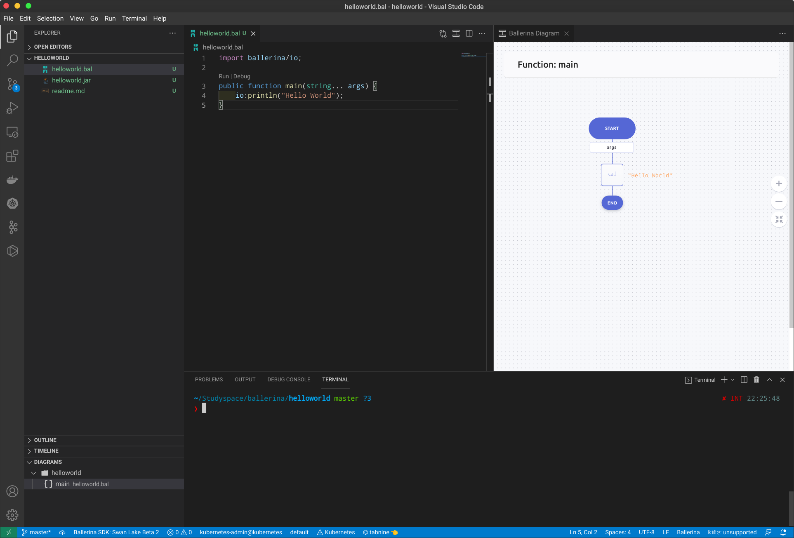

# RUN
```shell
❯ bal build ./helloworld.bal
Compiling source
        helloworld.bal

Generating executable
        helloworld.jar
```

# RUN
```shell
❯ bal build ./helloworld.bal
Compiling source
        helloworld.bal

Generating executable
        helloworld.jar
```

# Graphic
